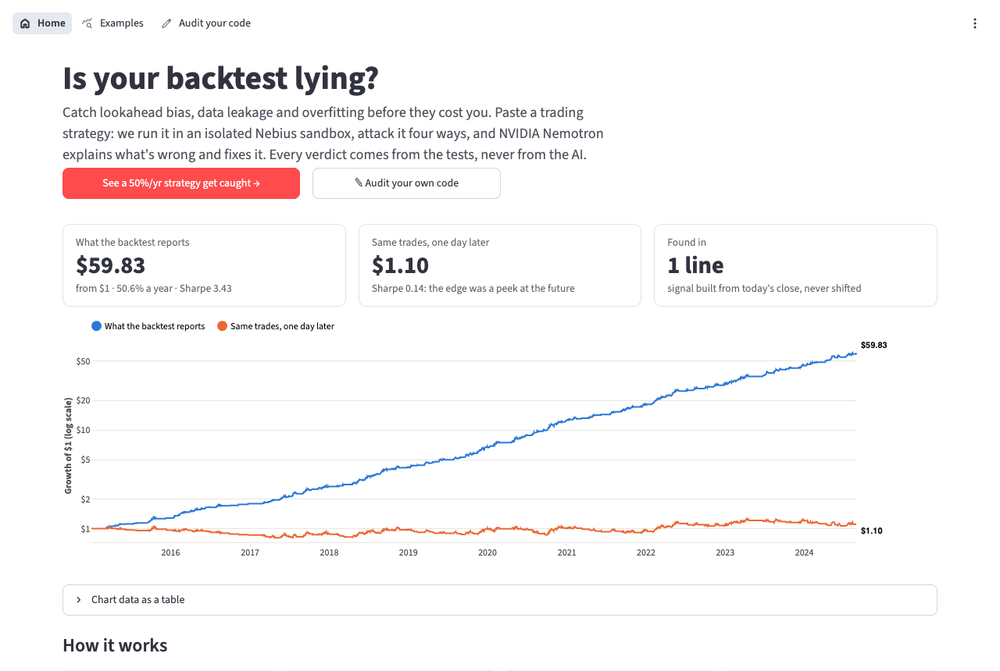
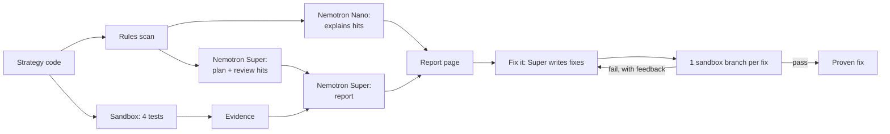

# Backtest Auditor

**Is your backtest lying? An agent that catches lookahead bias, data leakage and overfitting in trading-strategy code, then fixes it and proves the fix.**

**Live demo: https://backtest-auditor.streamlit.app** · MIT · Nebius × NVIDIA Global AI Hackathon, Coding & Agentic Engineering track



> ⚠️ Educational tool, not financial advice. It evaluates strategy *code*; it does not recommend trades.

## The problem

Backtests often look amazing because of bugs, not skill: **lookahead** (trading on today's close), **data leakage** (a `shift(-1)`, a centered average, a z-score over the whole history), or **overfitting** (keeping the luckiest of hundreds of settings). These bugs are easy to write, hard to spot, and expensive to trade on.

## What it does

1. **Scan:** deterministic rules flag known leak patterns. No AI.
2. **Attack:** four deterministic tests run the code **only inside an isolated Nebius Token Factory Sandbox**.
3. **Explain:** **NVIDIA Nemotron** points to the responsible line, says why, and suggests a change.
4. **Fix:** Nemotron writes candidate fixes; each is re-tested in its own **sandbox branch**, and a fix is accepted only if the tests pass.

**The tests decide, the AI explains.** Every verdict and number comes from code we run; Nemotron is overruled if it disagrees, and its numbers are checked.

### Results on the built-in gallery

Numbers from the sandbox, on synthetic random-walk prices (where no real edge can exist):

| Strategy | Mistake | Claims | Caught by | After the agent's fix |
|---|---|---|---|---|
| Lookahead | trades on today's close | 50.6%/yr, Sharpe 3.43 | delay + hide-the-future | 1.0%/yr |
| `shift(-1)` slip | "aligns" returns with `shift(-1)` | 63.9%/yr, Sharpe 4.13 | delay + hide-the-future + rule | 4.9%/yr |
| Weekly bfill | weekly signal back-filled onto days | 38.3%/yr | hide-the-future only | −7.6%/yr |
| Centered average | `rolling(center=True)` | 68.5%/yr | hide-the-future + rule (delay test passes) | 0.4%/yr |
| Full-history z-score | normalizes with future mean/std | 4.2%/yr | hide-the-future + rule | −3.1%/yr |
| Best of 279 | settings picked with hindsight | Sharpe 0.52 | unseen data (0.76 → 0.18) + luck | explained, not "fixed" |
| Honest SMA / RSI | none | ≈ 0 | **pass** (no false alarms) | nothing to fix |

## Try it (2 minutes)

1. Open **https://backtest-auditor.streamlit.app** and click any gallery card for its full audit.
2. Click **✎ Audit your own code**, choose **Start from → Lookahead**, and click **Run audit** (≈ 35 s, live).
3. Add `.shift(1)` to the flagged line and re-run, or click **Fix it** and watch two fixes get tested in parallel.
4. Or paste your own `run(prices)` strategy (the guide beside the editor explains the format) and upload your own price CSV.

## How it works



| Test | Catches | How |
|---|---|---|
| **Delay** | lookahead | Delay every position one bar (one week for weekday-only strategies); peeking strategies collapse. |
| **Hide-the-future** | lookahead, leakage, hindsight | On up to 40 dates, cut the data off and nudge that day's price; a position may only use past data, so it must not change. |
| **Unseen data** | overfitting | Best settings on the first 60% of history, tested on the rest. |
| **Luck** | overfitting | Deflated Sharpe ratio (Bailey & López de Prado, 2014): is the edge real after counting the tries? |

The sandbox tests run first, and paid AI calls start only if the code runs, so broken submissions cost nothing.

## How we use Nebius Token Factory and NVIDIA Nemotron

| Step | Model | Why |
|---|---|---|
| Plan | `nvidia/nemotron-3-super-120b-a12b` | Reads the code, flags lines, predicts verdicts, confirms or dismisses rule hits |
| Explain hits | `nvidia/NVIDIA-Nemotron-3-Nano-30B-A3B` | One sentence per hit: short, cheap, capped at 1,500 tokens |
| Report | `nvidia/nemotron-3-super-120b-a12b` | Plain-English verdicts, line numbers, fixes |
| Fix | `nvidia/nemotron-3-super-120b-a12b` | Minimal corrected files; failing tests fed back on retry |

**Why the scan isn't an LLM:** as a pattern checklist, Nano (and Super) found the buggy line only ~1 in 3 runs and took 3–54 s. Parsing the code is instant and can't invent lines, so Nano writes the explanations instead. All calls use Token Factory's OpenAI-compatible API with strict JSON-schema output.

**Token Factory Sandboxes:**
- **Isolation:** user code runs only in a sandbox, with no secrets inside.
- **Speed:** a prepared, tagged base image makes each audit ≈ 3 s.
- **Branching for fixes:** **Git-like branching** gives each candidate fix its own branch of one snapshot, run in parallel (3 branches in 2.6 s).
- **Hardened I/O:** per-run output markers mean a strategy can't fake a "PASS".

**Guardrails:**
- **No tip-offs:** comments and our answer key are stripped before Nemotron reads the code.
- **Checked output:** cited lines are verified against the source, verdicts are overwritten with the test results, and every number in a report must match the evidence.
- **Retries:** broken plans are retried.
- **Fix rules:** a fix must stay close to the original, add no third-party imports, pass hide-the-future, fail nothing, and still trade.

## Known limits

- **Overfitting isn't auto-fixed.** No code edit can un-see the data, and the app explains what to do instead.
- **Leaks too small to change any trade** are flagged only by the rules and Nemotron's review, not by the behavior tests.
- **Calendar detection** covers weekday rules only.
- **A hostile strategy could tamper with its own results** inside the sandbox. The sandbox protects the host; a self-audit can only fool its author.

## Cost guards

- **Measured spend:** token usage × catalog price goes into a daily ledger.
- **Hard caps:** live runs stop at **$0.15/day** ($0.75/day during judging, Dec 1–15); there are also run caps per day and per visitor, and a cut-off after judging. Worst case ≈ $20 in total, below the account's credit.
- **Free browsing:** the gallery uses saved audits and makes no paid calls. A scheduled GitHub Action keeps the app awake through judging.
- **Measured costs:** one audit ≈ $0.003, one fix ≈ $0.002.

## Run locally

```bash
python3.12 -m venv .venv && source .venv/bin/activate
pip install -r requirements.txt
cp .env.example .env        # NEBIUS_API_KEY, NEBIUS_PROJECT_ID, MODEL_FAST, MODEL_REASONING; LIVE_RUNS_ENABLED=true
streamlit run app/streamlit_app.py
pytest -q                   # 106 offline tests; RUN_SANDBOX_TESTS=1 / RUN_LLM_TESTS=1 for live ones
```

**Layout:**
- `app/`: the Streamlit pages and the saved gallery audits
- `agent/`: pipeline, planner, interpreter, scanner, fixer, sandbox, cost limits
- `attacks/`: the four tests
- `engine/`: the backtester
- `strategies/`: the gallery

Design notes are in [docs/ARCHITECTURE.md](docs/ARCHITECTURE.md).

## Feedback on Nebius and NVIDIA tools

Every friction point we hit is logged with dates and suggestions in [FEEDBACK_NOTES.md](FEEDBACK_NOTES.md). Examples:
- a cookbook model ID that doesn't exist on the API,
- SDK docs that don't match the PyPI package,
- Nano returning its answer in the reasoning field,
- silent sandbox output truncation.

## License

MIT, see [LICENSE](LICENSE). Educational tool, not financial advice.
